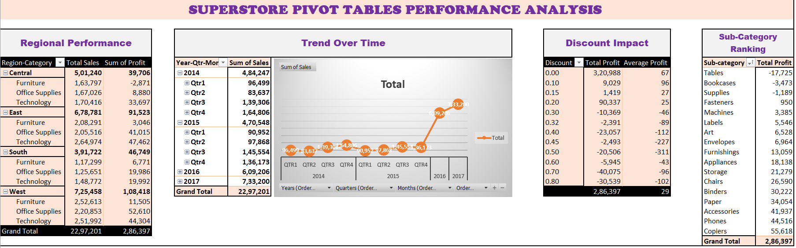

# Where Is Superstore Losing Money? An Excel-to-SQL Profitability Diagnostic

**Tools:** Excel (PivotTables) &middot; MySQL / MySQL Workbench
**Dataset:** Sample Superstore order-level data (region, category, sub-category, sales, profit, discount)

## The problem

Revenue and profit aren't the same thing. I used a two-stage approach — Excel PivotTables for fast exploration, then row-level SQL queries to confirm or correct what the exploration suggested — to find where Superstore was actually losing money, and why.

 

## Process

**Excel:** Built four pivots (Region &times; Category, monthly trend, profit by discount level, sub-category ranking). This surfaced the first signal: **Furniture generated nearly as much revenue as Technology but a fraction of the profit**, and **Central had the weakest margin despite not having the lowest sales** — pointing toward over-discounted Furniture, especially Tables and Bookcases, as the likely cause.

**Data cleaning in SQL:** Importing the same data into MySQL exposed what Excel had quietly tolerated — `Profit` imported as text (a mangled currency symbol was blocking numeric conversion), and `Order Date`/`Ship Date` imported in an unexpected `DD-MM-YYYY` format that a first conversion attempt got wrong before a `STR_TO_DATE` diagnostic query confirmed the actual format.

**SQL confirmation:** Rebuilt each pivot as a query, then went a level deeper than Excel could easily reach — breaking Tables/Bookcases profit out by region, and pulling every unprofitable region &times; sub-category combination with `HAVING SUM(profit) < 0`.

## Key findings

| Finding | Evidence |
|---|---|
| Furniture's margin (2.3%) trails Office Supplies and Technology (~17% each) | `GROUP BY` with margin calc |
| Profit turns negative past 20% average discount, and worsens sharply above 30% | `CASE WHEN` discount-band aggregation |
| East's Tables line is the single largest loss in the dataset (&minus;₹11,025 at 37.4% avg. discount) | Region &times; sub-category breakdown |
| Central's weak margin comes from breadth — 7 of 15 loss-making sub-category combos — not one bad product line | `HAVING`-filtered aggregate |

**The correction:** the pivots suggested Central's problem was Tables/Bookcases specifically. SQL showed the single worst loss was actually in East, driven by an outlier discount rate — while Central's real issue was a wide, shallow bleed across seven sub-categories.

## What this demonstrates

Cross-tool fluency (Excel &harr; SQL) &middot; real-world data cleaning (encoding and date-format issues, diagnosed rather than guessed) &middot; treating a hypothesis as something to test, not confirm &middot; translating query results into specific, actionable recommendations (a discount ceiling, a targeted regional review).

*Full SQL script, Excel workbook, and interactive dashboard included in this repo.*
